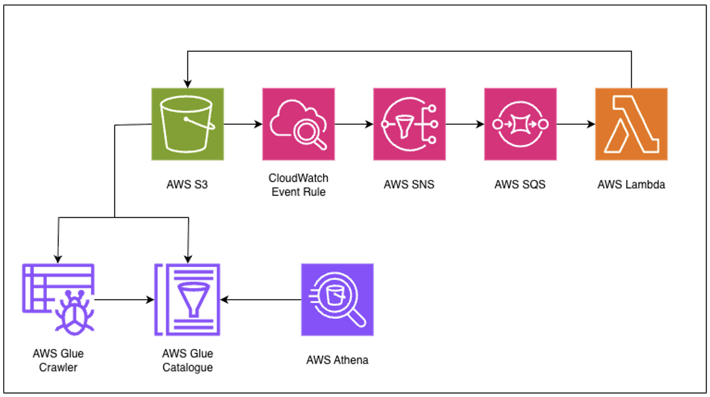

# AWS Serverless Data Pipeline (CSV → Parquet → Athena)

This project implements a **serverless data pipeline** on AWS that automatically processes CSV files uploaded to an S3 bucket, converts them into Parquet format, and makes them queryable via Amazon Athena using AWS Glue for schema management.

---

## 🚀 Architecture Overview



### **Flow Description**

1. **S3 Upload**
   - A CSV file is uploaded to an S3 bucket (`csv-files/` prefix).
2. **CloudWatch Event Rule**
   - Detects the new upload event and triggers an **SNS topic**.
3. **SNS → SQS**
   - The SNS topic publishes the message to an **SQS queue**.
4. **Lambda Trigger**
   - The Lambda function, subscribed to the SQS queue, retrieves the event and:
     - Downloads the CSV file.
     - Converts it to **Parquet format**.
     - Uploads the Parquet file to a new prefix (`parquet-files/`) in the same S3 bucket.
5. **AWS Glue Crawler**
   - The Glue crawler scans the Parquet data and updates the **Glue Data Catalog**.
6. **AWS Athena**
   - Queries can be run on the processed data directly from Athena.
   - Query results are stored in `s3://<your-bucket-name>/athena-queries/`.

---

## 🏗️ AWS Services Used

| Service | Purpose |
|----------|----------|
| **Amazon S3** | Stores input CSV files, output Parquet files, and Athena query results. |
| **Amazon CloudWatch** | Triggers an event on S3 upload. |
| **Amazon SNS** | Publishes S3 event notifications. |
| **Amazon SQS** | Buffers messages and triggers the Lambda function reliably. |
| **AWS Lambda** | Handles CSV-to-Parquet conversion logic. |
| **AWS Glue Crawler** | Infers schema and updates Glue Data Catalog. |
| **AWS Glue Data Catalog** | Stores metadata for Athena. |
| **Amazon Athena** | Enables querying of Parquet data. |

---

## 🧩 Data Flow Summary

| Step | Action | Trigger |
|------|---------|---------|
| 1 | CSV uploaded to S3 | User / Application |
| 2 | Event sent to CloudWatch | S3 PutObject Event |
| 3 | SNS → SQS message | CloudWatch Rule |
| 4 | Lambda processes CSV → Parquet | SQS message |
| 5 | Glue Crawler runs | Scheduled or Triggered |
| 6 | Athena queries data | User / BI Tool |

---

## ⚙️ Terraform Integration

If using **Terraform**, you can:
- Define S3, SNS, SQS, and Lambda infrastructure.
- Configure Glue Crawler and Athena query output location.
- Example Athena configuration:
  ```hcl
  resource "aws_athena_workgroup" "main" {
    name = "default"
    configuration {
      result_configuration {
        output_location = "s3://<your-bucket-name>/athena-queries/"
      }
    }
  }
